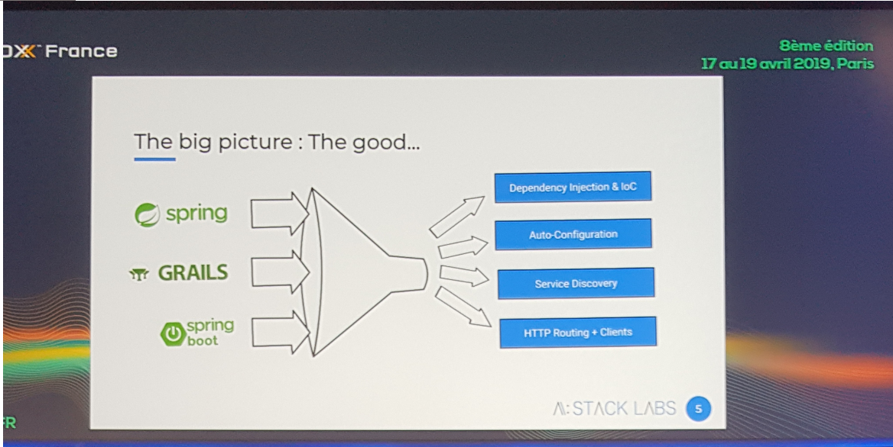
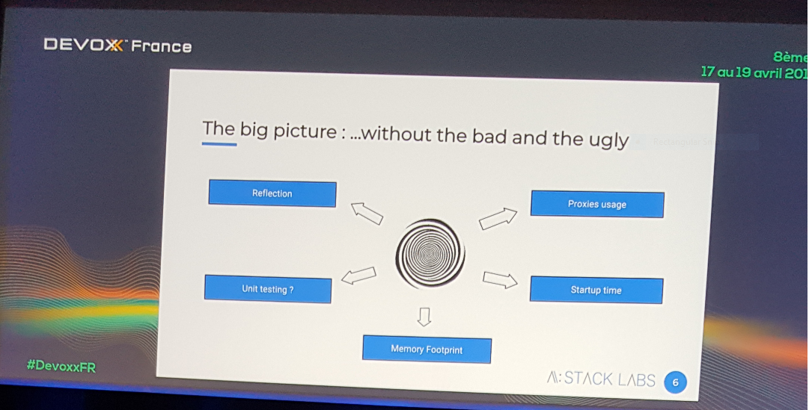
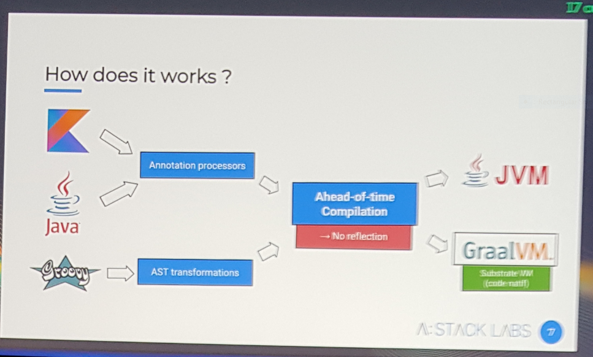

# Découvrez pourquoi Elixir sera votre prochain langage !

    
Hands-on Labs

    

    Dans cette <a href="https://cfp.devoxx.fr/2019/talk/AHP-9443/Decouvrez_pourquoi_Elixir_sera_votre_prochain_langage!">session pratique</a>, nous avons découvert le langage de programmation fonctionnelle <i><a href="https://elixir-lang.org/">Elixir</a></i> et son potentiel prometteur due à la machine virtuelle <i>BEAM</i> et son environnement d'exécution distribué et parallélisé. Nous avons expérimenté avec la syntaxe de ce langage via sa console interactive <i>iex</i> et un example pratique d'application de Chat avec sa framework Web <i><a href="https://phoenixframework.org/">Phoenix</a></i>
    

# Créer facilement des microservices (ou cloud native java) avec Eclipse MicroProfile

    
University

    

    Session de live coding où le projet <i><a href="https://microprofile.io/">Eclipse Microprofile</a></i> a était présenté comme alternative viable de Spring Boot. Les transparents sont accessibles sous ce <a href="https://speakerdeck.com/lbenoit/creer-facilement-des-microservices-ou-cloud-native-java-avec-eclipse-microprofile?slide=107">lien</a>. Eclipse Microprofile peut être vue comme un ensemble de spécification standard J2EE post J2EE 8 visant à standardiser la création d'application Java Microservice et Cloud Native. Cette spécification a était initiée en 2016 avec la version 1.0 et s'est limitée au départ au CDI 1.2, JAX-RS 2.0 et JSON-P 1.0 pour finir par englober une panoplie de spécifications dans sa version 2.2. Cette dernière finira par contenir les aspects authentification, traçabilité et fault tolerance. La présentation s'est terminée avec les perspectives futures qui consistent à ajouter les Stream réactifs et GraphQL voir être compatible avec Quarkus.
    Ce <a href="https://github.com/microprofile-extensions">lien</a> contient une liste exhaustive et à jour des extensions pour activer les différentes fonctionnalités du Microprofile.
    

# Quarkus: du live reload à la compilation native

    
Tools-in-Action

    

    Après une brève présentation de <i><a href="https://quarkus.io/">Quarkus</a></i>, cette <a href="">session</a> a enchaîné sur un example pratique qui montre l'utilisation d'un fichier de configuration unifié et le gain en taille des livrables et en performance dans les temps de démarrage avec l'approche AoT (Ahead of Time) en coopération avec la <i><a href="https://www.graalvm.org/">GraalVM</a></i>.
    

# Micronaut, le framework JVM ultra-light du futur

    
Tools-in-Action

    

    <i><a href="https://micronaut.io/">Micronaut</a></i> est une Framework très récente (apparue en Août 2018) basée sur la JVM. Micronaut se présente comme étant une synthèse des avantages des autres frameworks JVM (Spring, Grails et Spring Boot)
    
    et d'autre part en évitant leur limitations côté conception.
    
    Micronaut se base sur la technique de la compilation anticipée AoT (Ahead of Time) et évite l'usage du mécanisme de la Reflection.
    
    La présentation a montré un <a href="https://github.com/orevial/twitter-demo-micronaut-kotlin">example</a> de chargement de flux Twitter en Kotlin.
    

# Utiliser les flux réactifs c'est bien, les tester et les debugger c'est mieux !

    
Tools-in-Action

    

    Cette <a href="https://cfp.devoxx.fr/2019/talk/XAF-7489/Utiliser_les_flux_reactifs_c'est_bien,_les_tester_et_les_debugger_c'est_mieux_!">présentation</a> a pour but de montrer les difficultés qu'on rencontre lors du teste unitaire d'un code Reactif, en particulier avec les Frameworks <i><a href="https://github.com/ReactiveX/RxJava">RxJava</a></i> et <i><a href="https://projectreactor.io/">Reactor</a></i>. La difficulté vient du fait qu'un code adoptant le paradigme Reactif est multi-threaded donc non déterministe (l'ordre des éléments dans le flux n'est pas nécessairement respecté) et souvent asynchrone. Pour le cas asynchrone, il faut utiliser des Scheduler pour simuler un délais afin d'intercepter la réponse différée. Il y'a aussi des cas où on doit faire attention au volume de la réponse ce qui demande l'utilisation de la technique du <i>Polling</i>. Les flux réactifs sont réputés avoir des stack trace cryptique et difficile à lire, mais Reactor possède l'avantage d'avoir des sorties plus lisibles. En conclusion, tester des flux réactifs est délicat et demande un effort à part.
    

