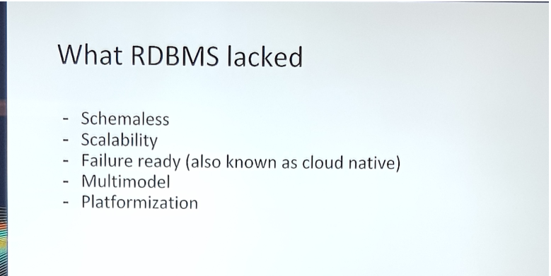
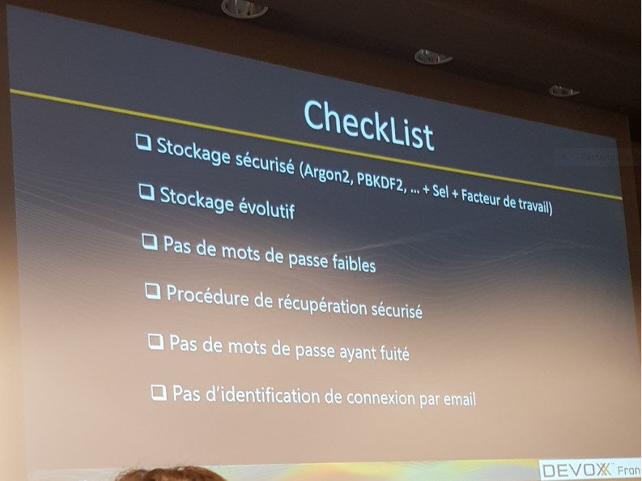
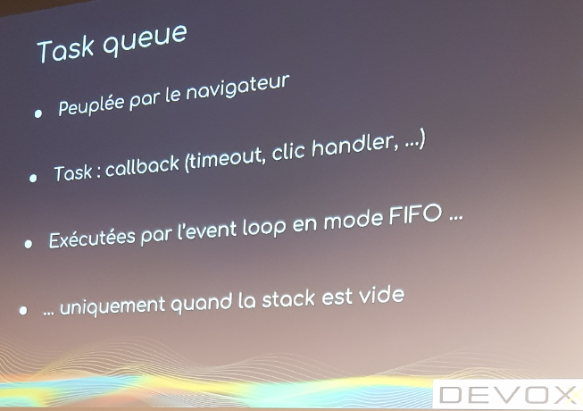
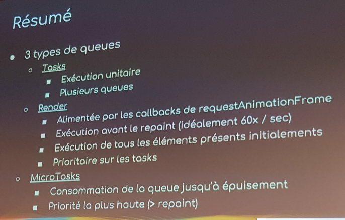

# La Keynote de Devoxx France
**Keynote**  
Présentation de différentes statistiques (nombre de participants, taux de visualisation sur Youtube, logistique), dans une mise en scène drôle, qui sont globalement positives et montrent le succès de l'événement Devoxx France.

# Le Bonheur au travail : au delà du bullshit.
**Keynote**  
Dans cette [intervention](https://cfp.devoxx.fr/2019/talk/ZGF-7420/Le_Bonheur_au_travail_:_au_dela_du_bullshit.), l'ingénieur et philosophe Christian Fauré, nous expose le côté nuisible et caché d'un environnement de travail vidé de tout sens de valeur ajoutée. Il nous introduit la notion de la _Prolitarisation_ de l'individu qui consiste à le priver du savoir et le transformer en un automate exécutant une tâche monotone semblable à la situation de la classe ouvrière à la veille de la Révolution Industrielle. Il attire notre attention sur les dangers latents que représente l'utilisation excessive des Frameworks informatiques qui visent à améliorer la productivité, vu la nature hautement compétitive du marché, mais qui finissent par nous rendre des esclaves car elles nous éloignent des principes fondamentaux sous jacents (donc du savoir créatif) et limitent notre apport à un savoir superficiel et éphémère. Le bonheur ne vient pas de l'emploie ou du poste occupé, mais de la valeur du Travail qui induit un sentiment de satisfaction venu de l'oeuvre et la quête du savoir et du sens qui sont, enfin du compte, l'essence même de notre éxistence.

# La bienveillance en entreprise
**Keynote**  
Sous le même thème du bonheur au travail, l'ancien commandant de la Marine Nationale Olivier Lajous, enchaîne avec un [discours](https://cfp.devoxx.fr/2019/talk/YMT-2000/La_bienveillance_en_entreprise) qui porte sur la relation avec l'autre dans le milieu du travail. Malgré l'aspect non individuel que relève l'idée d'un groupe où il y'a la bienveillance, son intervention se base sur le principe suivant: pour être en paix avec les autres, il faut commencer par se réconcilier avec soi-même. Par conséquence, un groupe où il y'a un conflit entre ses membres accuse un problème interne au niveau individuel. L'intervenant a employé la [Parabole des Porcs-épics](https://www.schopenhauer.fr/fragments/porcs-epics.html) du philosophe Allemand Schopenhauer pour nous expliquer l'importance d'adopter une distance adéquate avec l'autre pour éviter les conflits et pour trouver un compromis pour la cohérence de l'équipe. Il invoque aussi les _4 Accords Toltèques_ (parole impeccable, ne pas prendre les choses d'une manière personnelle, faire de son mieux, ne pas faire de suppositions) comme une philosophie de conduite personnelle pour atteindre la paix interne et par conséquence l'harmonie avec les autres.

# PostgreSQL c'est le nouveau NoSQL
**Conférence**  
Selon le site [db-engines](https://db-engines.com/en/systems), il existe quelque 330 systèmes de base de données de tout types (relationnel ou NoSQL). PostgreSQL a fait l'objet de cette [conférence](https://cfp.devoxx.fr/2019/talk/DRV-0739/PostgreSQL_c'est_le_nouveau_NoSQL) qui avait pour objectif de nous montrer comment ce système de base de données relationnel est inscrit dans la même tendance générale (appelée _NewSQL_) qui consiste à adopter le _Multimodel_ c'est à dire avoir des fonctionnalités NoSQL comme le schema non rigide ou les données documents. Pour commencer, le conférencier à expliqué les concepts NoSQL qui manquent dans les bases relationnelles.

Ensuite, la présentation a continué avec les fonctionnalités dans PostgreSQL qui visent à mettre en place ces concepts qu'on trouve dans les base NoSQL, à savoir:  
- _Schemaless_: les colonnes indexées du type JSON et JSONB qui portent les types et qui sont indexées.
- _Scalability/Replication, Failure Ready_: la fonctionnalité du _Sharding_ qui assure la réplication et la création des partitions des tables, la réplication peut être physique (copie source destination) ou logique (par stream d'écriture). En outre, PostgreSQL supporte des requêtes distribuées et parallèles.
- _Multimodel_: l'utilisation des _Foreign Data Wrappers_ qui permettent de manipuler des données en provenance d'autres sources NoSQL. Sans oublier les _Temporal Queries_ qui rapprochent PostgreSQL des bases Time Series comme [_Prometheus_](https://prometheus.io/).

Enfin, une démonstration du nouveau [_Reactive JDBC Driver R2DBC_](https://r2dbc.io/) pour montrer comment il nous permet de gérer d'une manière asynchrone et robuste notre connexion.

# Retour aux sources de l'authentification et ce qui va changer en Septembre 2019 pour nos achats
**Conférence**  
Cette [conférence](https://cfp.devoxx.fr/2019/talk/MIT-3734/Retour_aux_sources_de_l'authentification_et_ce_qui_va_changer_en_Septembre_2019_pour_nos_achats) a commencé par relater l'histoire des mécanismes d'authentification ([Basic ou RFC-2617](https://www.ietf.org/rfc/rfc2617.txt), stockage dans la base de données, les fichiers apache [.htpasswd](https://httpd.apache.org/docs/2.4/programs/htpasswd.html) et [.htaccess](https://httpd.apache.org/docs/2.4/howto/htaccess.html)) pour finir avec la technique actuelle du _hashage_, qui se base sur les ingrédients suivants:
- Strong: le mot de passe doit être suffisamment long et contient un maximum de diversité de symbole, donc, imprévisible.
- Adaptative: il fonctionne indépendamment de l'algorithme de chiffrage.
- Salted: l'utilisation d'un _salt_ qui est une entrée aléatoire ajoutée à l'algorithme de hashage afin de varier le résultat qui est le mot de passe chiffré, ça permet d'éviter toute redondance si un mot de passe est choisi plus qu'une fois.
- des algorithmes de hashage robustes comme [Argon2](https://en.wikipedia.org/wiki/Argon2), [scrypt](https://en.wikipedia.org/wiki/Scrypt) ou [bcrypt](https://en.wikipedia.org/wiki/Bcrypt).
 
Le bon choix de ces facteurs va permettre d'augmenter l'effort nécessaire (_Work Factor_) pour déduire le mot de passe à partir de sa transformation.  
Afin d'enforcer la robustesse du choix des mots de passe au niveau application, la conférence suggère d'utiliser des outils de test des mots de passes comme la librairie [zxcvbn](https://github.com/dropbox/zxcvbn) de DropBox ou l'API [HaveIBeenPawned](https://haveibeenpwned.com/API/v2) qui permet de vérifier si un mot de passe a était compromis ou non (au moins selon la base de données sur laquelle se base l'API).

Ci-dessous un résumé sous forme de checklist sur les critères de robustesse d'un système d'authentification.

Dans le cadre actuel des API et des architectures microservices, des protocoles d'authentification sont apparus notamment [_OpenIDConnect_](https://openid.net/connect/) et il est fortement recommandé d'utiliser des OpenID Providers certifiés comme [Auth0](https://auth0.com/), [keycloack](https://www.keycloak.org/) ou [France connect](https://franceconnect.gouv.fr/).

L'authentification est renforcée par un schéma dit _Double Factor Authentication_ ou _2FA_ qui consiste à ajouter un facteur de vérification de l'identité en plus du mot de passe et ce pour les opérations critiques comme le paiement en ligne. Un example simple est celui des codes envoyés par SMS suite à l'authentification afin de compléter la démarche sécurisée. Le deuxième facteur est associé d'une manière unique et sécurisée à l'utilisateur et peut être de nature:
- biométrique: empreinte digitale, reconnaissance faciale
- matériel: carte SIM, badge RSA, les certificats (préconisé par l'ANSSI)
- géographique: empêcher une connexion d'un endroit différent à une courte période après la première
- comportementale: identifier les habitudes de l'utilisateur lors de sa connexion pour bloquer les sessions volées

Concernant la date du Décembre 2019, une directive de la DSP2 (Directive pour les Services de Paiement) va rendre obligatoire le schéma 2FA pour sécuriser les opérations de paiement.

Pour les perspectives futures des standards d'authentification, on peut mentionner:
- _Universal 2nd Factor_ ou [_U2F_](https://en.wikipedia.org/wiki/Universal_2nd_Factor) qui vise à standardiser une forme d'authentification renforcée basée sur des supports matériels comme les clés USB
- le projet [_FIDO2_](https://en.wikipedia.org/wiki/FIDO2_Project)
- [_WebAuthn_](https://webauthn.io/) un standard W3C

# Event loop et asynchronisme en JavaScript
**Quickie**  
Cette brève [présentation](https://cfp.devoxx.fr/2019/talk/YNA-8521/Event_loop_et_asynchronisme_en_JavaScript) nous a montré la gestion en interne de l'asynchronisme en JavaScript dans les navigateurs. En effet, les appels asynchrones sont mis à part des une queue spécifique et ne sont exécutés (par l'_Event Loop_ et en mode FIFO) que lorsque la pile des appels est vide.

Mais les tasks ne sont pas tous les même, car ils existent des tasks qui sont de nature plus prioritaire comme l'affichage, d'ou l'existence de plusieurs queues par type.

Les transparents sont disponibles sous ce [lien](https://t.co/TKdWDCUdry).

# Introduction to Face Processing with Computer Vision
**Conférence**  
Une [présentation](https://cfp.devoxx.fr/2019/talk/LQO-4838/Introduction_to_Face_Processing_with_Computer_Vision) sur l'état d'art de la reconnaissance faciale qu'on trouve souvent dans les applications comment FaceBook et SnapShat. La base dans les démarches de traitement des images est de considérer l'image comme un _Tensor_ du type (x, y, (R, G, B)) où x et y sont les dimensions de l'image et (R, G, B) les niveaux de couleurs. Ils existent deux types d'algorithmes pour la reconnaissance faciale:
- les algorithmes conventionnels basée sur le traitement directe des grandeurs physiques pour aboutir à un modèle (HOG pour Histogram Oriented Gradient) où on calcule un gradient moyen par une zone de 16 pixels pour établir un patron général du visage

- les algorithmes basées sur les réseaux de neurones (Convolutional Neural Networks) et des modèles entraînés au préalable

La bibliothèque [face_recognition](https://github.com/ageitgey/face_recognition) pour Python est bien réputée pour sa simplicité d'utilisation.

# Cats, Qubits, and Clouds: The Quantum Future
**Conférence**  

# La gestion de l'authentification et de l'autorisation dans une architecture microservices ? Pas de soucis !
**Conférence**  

# Hexagonal at Scale, où l'art de découper et organiser ses services
**Conférence**  

# S'il te plait... dessine moi un vrai test d'intégration
**Tools-in-Action**  
Cette [session](https://cfp.devoxx.fr/2019/talk/DLJ-1531/S'il_te_plait..._dessine_moi_un_vrai_test_d'integration) a montré un outil fait par l'équipe de Continious Delivery chez OVH, cet outil s'appelle [CDS](https://github.com/ovh/venom) qui permet d'exécuter des tests d'intégration. Les intervenants ont commencé par présenter la problématique qui a engendré le développement de cet outil. Les tests d'intégration sont définis comme étant "tester les fonctionnalités d'un système sur l'ensemble des composants via des scénarios utilisateur", ceci dit, le critère global des tests va nécessiter un effort de scripting pour les lancer, dans un ordre bien défini qui reflète le scénario utilisateur, à travers tout le système. En pratique, les auteurs de l'outil se sont trouvé avec un script Shell de plus de 300 lignes difficile à maintenir. L'outil CDS qui ont développé se base sur les principes suivants:
- pas de _boilerplate_ code: pas de code à écrire pour spécifier les tests, juste les fichiers de configuration
- multi-protocole: il supporte tout les types de communication inter-composant (Web, mail ...)
- accessible par les interfaces en mode ligne de commande
- intégrable dans les pipelines CI/CD

En pratique, les Test Suit sont spécifiés dans des fichiers .yml où qui contient des scénarios à exécutés par l'outil [venom](https://github.com/ovh/venom/tree/master/tests) en ligne de commande.

# Améliorez la performance et l'UX de vos app avec React Suspense
**Tools-in-Action**  
Cette [démonstration](https://cfp.devoxx.fr/2019/talk/EJW-3475/Ameliorez_la_performance_et_l'UX_de_vos_app_avec_React_Suspense) nous a montré la nouvelle API React Suspense pour le chargement asynchrone des composants, cette API présente une manière générique de suspendre l'affichage en attendant qu'une resource (image, video) ou un autre composant soit prêt.  
Le code source du code qui a servit pour la démo est disponible sous ce [lien](https://github.com/romaindso/devoxx-2019).
