# Accessibilité
**Keynote**  
Ce [keynote](https://cfp.devoxx.fr/2019/talk/CKW-8744/Accessibilite) s'intègre dans le même thème de bienveillance et bien être dans le travail via le concept d'empathie. En effet, l'intervenante souffre d'un handicap de vision et travaille quotidiennement avec les sites web. Elle a fait découvrir les différents troubles de vision qui peuvent affecter les personnes afin de nous sensibiliser sur l'importance de l'accessibilité.  
:information_source: pensez au côté accessibilité lors de la conception des applications.  
:information_source: pour les applications web, il est fortement conseillé de considérer les bonnes pratiques suivantes pour assurer l'accessibilité aux malvoyants:
- utiliser l'attribut _alt_ pour les images car ça aide les logiciels de navigation pour les malvoyants.
- ne pas faire un saut brusque d'ordre entre les balises _h_, example ne pas faire suivre un _h1_ par un _h4_ directement.
- pour les méta-data des pages HTML, indiquer correctement la langue _fr_ pour les articles francophones.

# Le refactoring le plus difficile de ma carrière
**Keynote**  
Cette [intervention](https://cfp.devoxx.fr/2019/talk/UPW-7883/Le_refactoring_le_plus_difficile_de_ma_carriere) parle de l'expérience personnelle d'un "Star" dans notre domaine avec la _Depression_. Ce qu'on peut retenir est que vu les pressions dans la vie professionnelle, ça peut arriver à tout le monde.  
Les slides de la présentation sont disponibles via ce QR Code (pour ceux qui savent l'utiliser)

# Philosophy of HumanOps
**Keynote**  
Ce [keynote](https://cfp.devoxx.fr/2019/talk/YLK-5268/Philosophy_of_HumanOps) présente une idée originelle qui met le facteur humain au centre de tout projet.

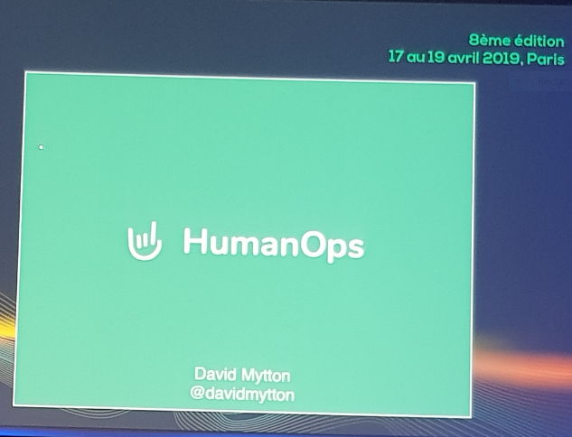

Avec des transparents ayant comme photo d'arrière plan des scènes filmées au Japon, l'auteur fait allusion au problème du _burn out_ au travail causé par la sollicitation intensive et stressante des employés pour le maintenance des applications critiques. Le principe est simple et peut être réduit dans cette simple égalité évoquée par l'intervenant `humain reliability == product reliability`. En effet, il est difficile d'atteindre un bon niveau de productivité pour un employé qui passe des heures tardives et qui ne prend pas suffisamment de repos. Pour cela, des solutions sont proposées comme:
- penser dès le départ au facteur humain en automatisant le maximum de tâches pour éviter les sollicitations tardives
- mettre en place une procédure de _checklist_ qui donne dans le cas d'une intervention les étapes nécessaires pour débloquer la situation (cette idée existe déjà dans le domaine de l'aéronautique et a fait ses preuves)
- optimiser le mécanisme d'alertes automatiques afin de limiter le flux d'informations non utiles et ainsi le stress

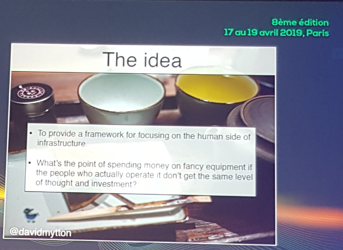

# Une API, de l'idée à la production, en mode agile avec Red Hat !
**Conférence**  
Une [démo](https://cfp.devoxx.fr/2019/talk/OWQ-3436/Une_API,_de_l'idee_a_la_production,_en_mode_agile_avec_Red_Hat_!) d'outils internes mais Open Source en utilisation chez Red Hat qui facilitent le prototypage et le déploiement des API.

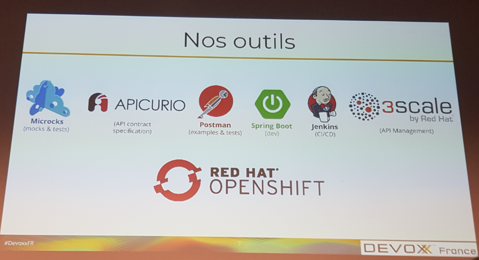

Ces outils sont:
- [Microcks](http://microcks.github.io/): un outil de prototypage d'API REST et totalement compatible avec Swagger et OpenAPI pour la documentation
- [Apicur](https://www.apicur.io/): un outil pour la conception des API REST

Ces utilitaires ont étaient intégrés dans un cycle de test par Postman et de déploiement sur Jenkins et OpenShift.

# Real Quantum Computing
**Conférence**  
Une [démo](https://cfp.devoxx.fr/2019/talk/VDM-2207/Real_Quantum_Computing) sur un ordinateur quantique du Cloud IBM de l'example du Chat de Schrodinger. Le résultat attendu était de 50/50 mais vu les erreurs, il y'a eu d'autres résultats ce qui montre l'imperfection des machines actuelles. La présentation a évoqué les algorithmes quantiques connues comme [Shor](https://en.wikipedia.org/wiki/Shor%27s_algorithm), [Deutsch–Jozsa](https://en.wikipedia.org/wiki/Deutsch%E2%80%93Jozsa_algorithm) et [BB84](https://en.wikipedia.org/wiki/BB84).  
Ce modèle en couches d'un ordinateur quantique montre la difficulté de garder un grand nombre de Qbit dans un état cohérent.

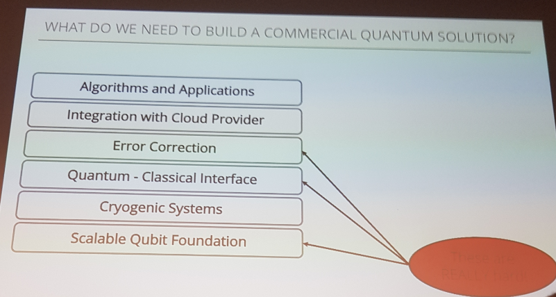

# Faites comme Netflix, abandonnez Hystrix !
**Quickie**  
[Hystrix](https://github.com/Netflix/Hystrix) vient d'être abandonné par Netflix à la faveur de [Resilience4j](https://github.com/resilience4j) qui adopte une approche plus dynamique dite _Adaptive Concurrency Limits_. Cette [présentation](https://cfp.devoxx.fr/2019/talk/MCV-0005/Faites_comme_Netflix,_abandonnez_Hystrix_!) a eu comme sujet le principe de cette approche adaptative et ses avantages qui ont rendu Hystrix obsolète.

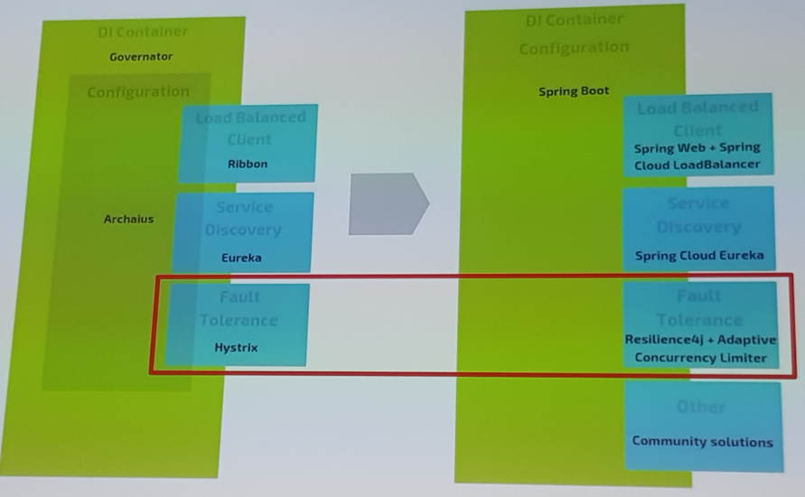

Resilience4j offre (en plus des patterns connus comme _Circuit Breaker_) les fonctionnalités du _Bulk Heading_ qui consiste à créer un _Thread Pool_ par instance de service et l'_ACL_ ou _Adaptative Concurrency Limits_ qui consiste à l'auto découverte des limites des files d'attente pour les requêtes selon le temps de réponse

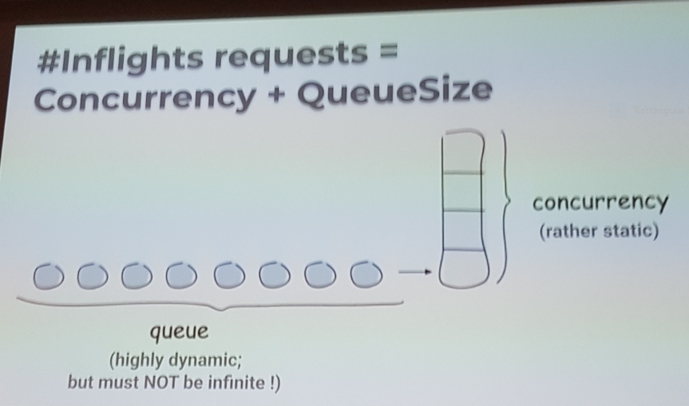

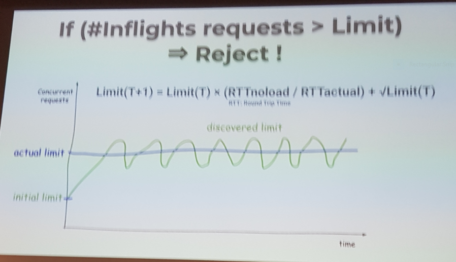

Plus de détails sur le principe du _Concurrency Limits_ est disponible sous ce [lien](https://github.com/Netflix/concurrency-limits).

# Micro Frontend: le casse tête des micro services étendu au FrontEnd !
**Conférence**  
Cette [conférence](https://cfp.devoxx.fr/2019/talk/GXO-0317/Micro_Frontend:_le_casse_tete_des_micro_services_etendu_au_FrontEnd_!) a attiré note attention sur le fait que les composants front end sont resté des monolith dans un environnement microservice que le back end bénéficie de ses avantages

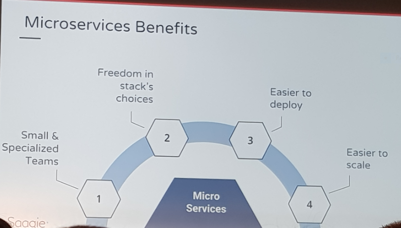

ce qui a donné l'idée d'étendre le principe des microservices aux interfaces utilisateur

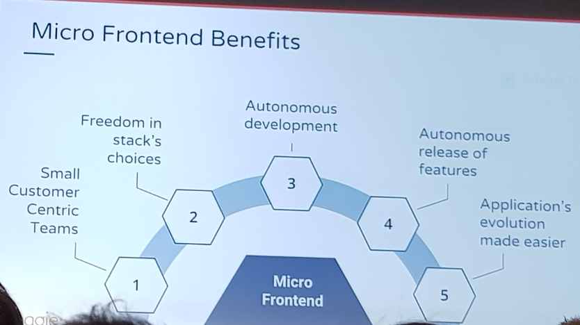

ce qui va engendrer des GUI avec des technologies hétérogènes

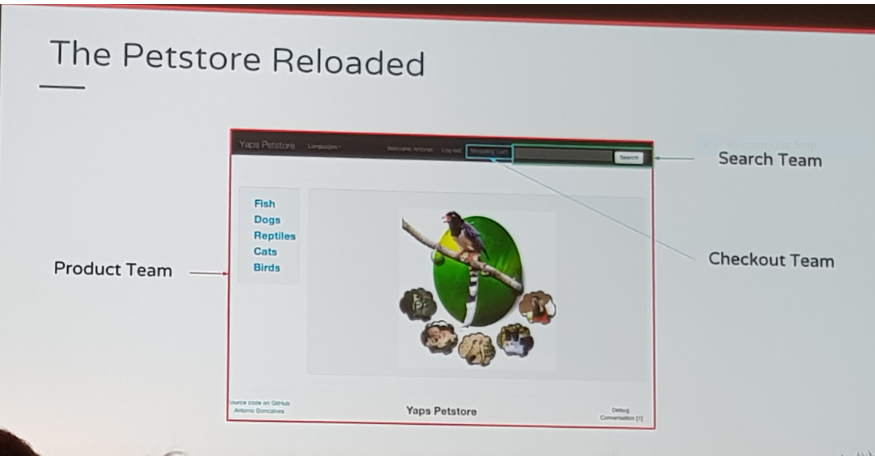

mais en pratique les implémentations ont fini par nuire à l'expérience utilisateur et à dégrader la performance.  
Conclusion: le concept des _Microfrontend_ est très difficile à mettre en oeuvre.

# Micronaut, Dragon-Slayer (Spring/boot) or just another framework
**Conférence**  
Cette [conférence](https://cfp.devoxx.fr/2019/talk/DIV-1873/Micronaut,_Dragon-Slayer_(Spring%2Fboot)_or_just_another_framework_) fait la comparaison entre Spring Boot et Micronaut à travers un example simple d'application REST.

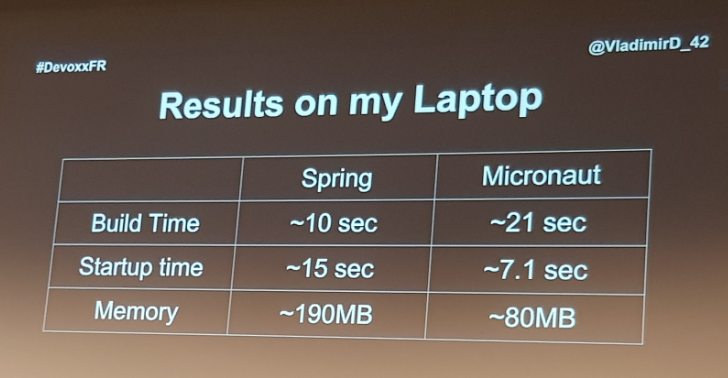

A travers l'[example](https://github.com/vladimir-dejanovic/micronaut-vs-spring-boot), côté code, Spring a l'avantage de limiter l'effort de développement grace à son écosystème très varié (JPA, REST ...), mais du point de vue performance, Micronaut à un grand avantage dans les temps de démarrage et l'empreinte mémoire limitée grace à la GraalVM (avec laquelle Spring Boot n'est pas encore compatible).

Conclusion: Micronaut n'est pas sensé remplacer Spring Boot pour les applications existantes, mais il est un très bon candidat pour les nouveaux projets faits from scratch.

:information_source: à l'instant actuelle, Micronaut ne supporte pas les annotations Lombok.

# Migrer ses APIs vers GraphQL: pourquoi? comment!
**Conférence**  
Cette [conférence](https://cfp.devoxx.fr/2019/talk/USP-7583/Migrer_ses_APIs_vers_GraphQL:_pourquoi%3F_comment!) parle d'une solution basée sur [_GraphQL_](https://graphql.org/) pour résoudre la complexité croissante d'une architecture microservice qui souffre des problèmes suivants:
- forte dépendance entre différents services
- gérer un format de données (date et montant) qui varie d'un client à un autre
- un output volumineux des API

GraphQL a permit de créer une API cohérente caractérisée par:
- un schéma simple
- cacher les complexités du domaine
- simplifier le développement front end

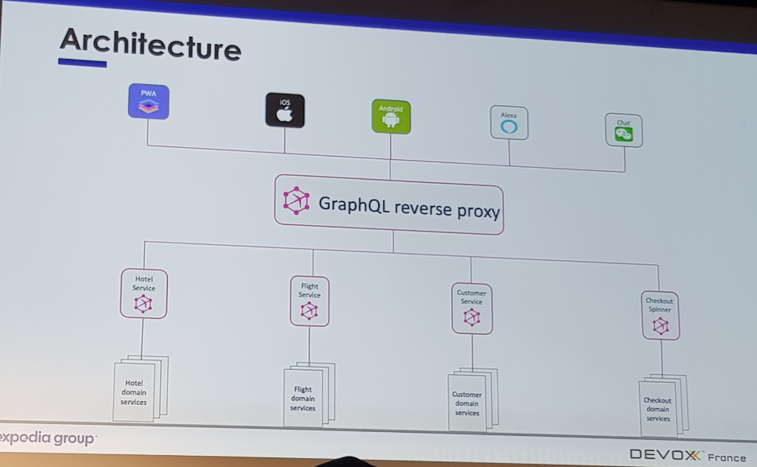

# Que se passe-t-il sous le capot ? Exploration au coeur de la JVM.
**Conférence**  
Très intéressante [conférence](https://cfp.devoxx.fr/2019/talk/NYE-1306/Que_se_passe-t-il_sous_le_capot_%3F_Exploration_au_coeur_de_la_JVM.) sur les arcanes de la JVM

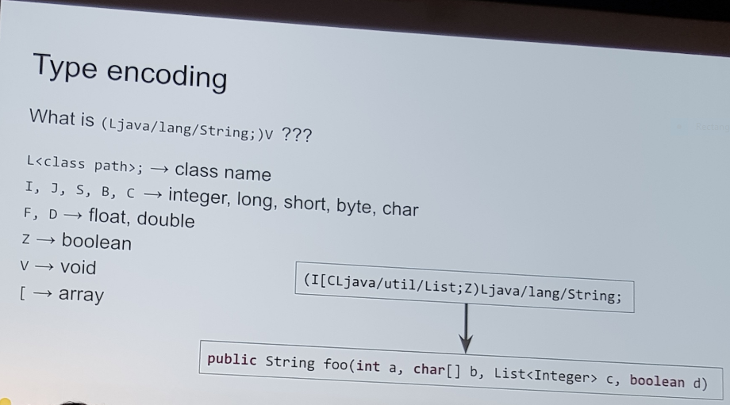

Le format des types dans le Byte Code Java.

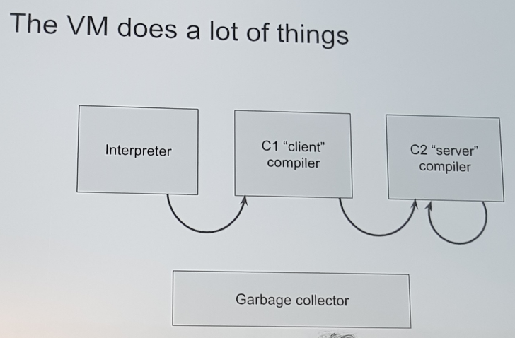

Les composants internes de compilation

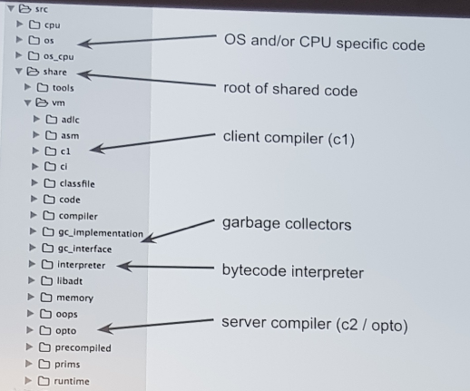

La structure du code de la JVM

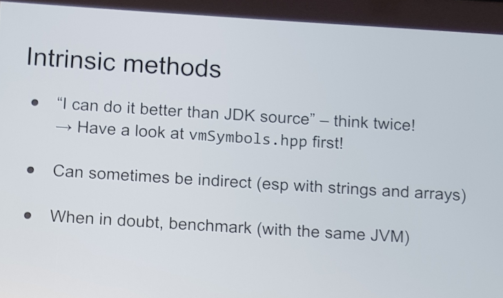

en finissant par expliquer les méthodes intrinsèques qui sont des implémentations de traitement bas niveau dans le language machine.

# Les APIs hypermedia expliquées simplement
**Conférence**  
Cette [présentation](https://cfp.devoxx.fr/2019/talk/YRA-2944/Les_APIs_hypermedia_expliquees_simplement) fait l'analogie entre le principe des liens hypertextes dans une page Web et le niveau de maturité _HATEOAS_ pour les services REST. Conclusion: le HATEOAS est un _Nice to Have_ qui demande plus d'efforts pour le mettre en place et le rendre adapté à l'aspect sécurité des API REST.
